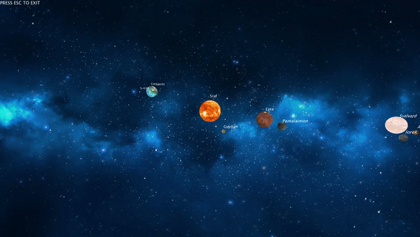

# Planetary system

###### Alberto Ramos Sánchez

<center></center>

En esta práctica hemos realizado el diseño de un sistema solar con una estrella, 5 planetas y sus respectivos satélites. Cada objeto del sistema tiene un nombre, que es indicado mediante una etiqueta que acompaña a cada uno de ellos:

- __Estrella__ : Sraf
- __Planetas__:
  - __*Gyptian*__: no posee satélites.
  - __*Lyra*__: con un satélite natural llamado __*Pantalaimon*__.
  - __*Cittàgazze*__: con un satélite artificial y geoestacionario llamado __*S-638*__
  - __*Svalbard*__: con 2 satélites naturales llamados __*Amber*__ y __*Iorek*__
  - __*Bolvangar*__: sin lunas.

La estrella central emite luz propia, que ilumina a los planetas y satélites que orbitan a su alrededor. __Para activar y desactivar esa luz, podemos pulsar la *barra espaciadora*__.

### Representación de los objetos del sistema solar.

Para representar los objetos del sistema solar, tenemos en el fichero *model.java* las clases *Star*, *Astro*, *StatSatellite*.

La clase *Star* representa la estrella central, que es dibujada mediante una esfera. Para simular la emisión de luz, añadimos un punto de luz omnidireccional con la función *pointLight*.

La clase *Astro* representa tanto a planetas como a satélites. Posee como atributos una distancia al objeto que orbita y un tamaño (radio).

Al dibujarlo, trasladamos la posición a la distancia al objeto que orbita. Para simular el movimiento, rotamos el objeto antes de trasladarlo, para simular el movimiento de traslación; y después de trasladarlo, para simular el movimiento de rotación.
```java
rotateY(this.translation);
translate(this.distance, 0);
rotateY(this.rotation);
shape(this.shape);
```
Posteriormente, para dibujar las etiquetas sin que se roten, deshacemos las rotaciones del astro actual y de todos los objetos *padre* (el atro que orbita, y todos los sucesivos). Tambien deshacemos cualquier otra rotación realizada, como la aplicada al planeta *Gyptian*, que tiene una orbita distinta a los otros planetas.

Esto lo hacemos en una matriz de transformación distinta, para mantener las transformaciones necesarias para simular el movimiento de los planetas.


```java
pushMatrix();
  // Deshacer rotaciones..
  // .. de padres
  for(Astro a : parent) {
    rotateY(-a.translation);
    rotateY(-a.rotation);
  }
  // .. del actual
  rotateY(-this.translation);
  rotateY(-this.rotation);
  // .. otras rotaciones
  for(float e: undo_rotation[0]) rotateX(-e);
  for(float e: undo_rotation[1]) rotateY(-e);
  for(float e: undo_rotation[2]) rotateZ(-e);

  textMode(SHAPE);
  fill(col);
  textSize(20);
  text(txt, 0, - this.radius - hint_space, 0);
  fill(255);
popMatrix();
```

Para dibujar un planeta con sus lunas seguimos el siguiente esquema:

```java
pushMatrix();
planet4.draw(new Astro[]{}, "Svalvard", BLACK, 30, 40);
  pushMatrix();
  moon4_1.draw(new Astro[]{planet4}, "Amber", BLACK, 30, 20);
  popMatrix();

  pushMatrix();
  moon4_2.draw(new Astro[]{planet4}, "Iorek", BLACK, 30, 20);
  popMatrix();
popMatrix();
```
La transformación principal al centro de la pantalla la mantenemos global para todos los objetos del sistema solar. Posteriormente aislamos el dibujo de cada uno en matrices de transformación distintas. A su vez, los satelites que no son geoestacionarios, los ailamos, para que su orbita sea independiente a la rotación del planeta. En cada uno de los satelites indicamos el planeta que orbita, para poder dibujar las etiquetas sin que roten.


En la clase StatSatellite representamos un satélite geoestacionario importando una figura 3D de un satélite. Como queremos que sea geoestacionario, solamente trasladamos el objeto la distancia a la que se encuentra del planeta que orbita.

Para que sea geoestacionario, mantenemos la misma matriz de transformación para el planeta y el satélite:

```java
pushMatrix();
planet3.draw(new Astro[]{}, "Cittàgazze", BLACK, 20, 50);
stat.draw(new Astro[]{planet3}, "S-638", BLACK, 20, 20);
popMatrix();
```

### Referencias

- Textura de planetas: <http://www.texturesforplanets.com/>
- Textura de estrella: <https://www.solarsystemscope.com/textures/>
- Textura de fondo: <https://wallpaperplay.com/board/blue-space-wallpapers>
- Satélite: <https://free3d.com/3d-model/satellite-v1--384167.html>
- Nombres de objetos: [*His Dark Materials*](https://en.wikipedia.org/wiki/His_Dark_Materials)
